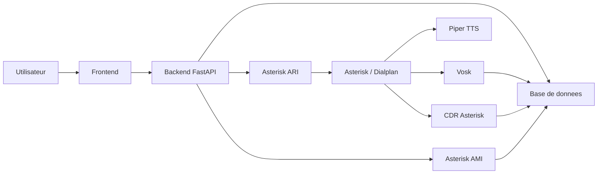

# Monitoring d'Appels TCU - Documentation utilisateurs, administration et exploitation

## 1. Presentation de l'application

### A quoi sert l'application ?

L'application **Monitoring d'Appels TCU** permet de superviser et de piloter des scenarios d'appels telephoniques via Asterisk.

Elle permet notamment de :

- creer des scenarios d'appels ;
- lancer un scenario manuellement ;
- planifier des scenarios ;
- suivre l'historique des appels ;
- consulter les statuts telephoniques ;
- consulter les resultats Vosk et les transcriptions enregistrees en base ;
- afficher le mode d'appel utilise : `Standard`, `DTMF`, `TTS`, `TTS + DTMF` ;
- importer des scenarios en masse par CSV ou JSON ;
- exporter les scenarios et l'historique.

### Probleme metier adresse

L'application repond au besoin de verifier automatiquement des parcours telephoniques :

- controle de joignabilite ;
- controle de decroche ou non decroche ;
- verification de parcours DTMF ;
- controle de mots-cles detectes dans une transcription Vosk ;
- suivi des erreurs trunk ou erreurs techniques ;
- supervision de scenarios recurrents.

Elle donne une vue unique entre le scenario prevu, l'appel reel, le resultat technique et le resultat metier.

### Utilisateurs cibles

Les profils fonctionnels identifies sont :

| Profil | Usage principal |
|---|---|
| Utilisateur metier / supervision | Consulter le dashboard, l'historique, les resultats Vosk et lancer des controles. |
| Administrateur fonctionnel | Creer, modifier, importer, exporter, activer/desactiver et planifier les scenarios. |
| Equipe Infrastructure / Production | Deployer, configurer, surveiller l'API, la base, ARI, AMI et le scheduler. |

Important : aucun mecanisme d'authentification ou de gestion de roles n'est visible dans le code actuel. Tous les utilisateurs qui accedent a l'interface disposent donc, techniquement, des memes actions.

## 2. Fonctionnalites principales

### Fonctionnalites accessibles dans l'application

#### Tableau de bord

Le tableau de bord affiche une synthese des derniers appels charges :

- nombre d'appels suivis ;
- appels decroches ;
- appels non decroches ;
- mots-cles OK ;
- messageries vocales ;
- erreurs trunk ;
- appels TTS ;
- TTS detectes.

Il affiche aussi une table des derniers appels avec filtres simples.

#### Scenarios

L'onglet `Scenarios` permet de :

- creer un scenario ;
- modifier un scenario existant ;
- activer/desactiver un scenario ;
- supprimer un scenario ;
- lancer un scenario immediatement ;
- tester la configuration d'un scenario ;
- filtrer les scenarios par recherche texte, statut et frequence ;
- importer des scenarios par CSV ou JSON ;
- telecharger un modele CSV ;
- exporter les scenarios au format JSON ;
- recharger uniquement la liste des scenarios.

Champs fonctionnels d'un scenario :

| Champ | Description |
|---|---|
| Nom | Nom fonctionnel du scenario. |
| Categorie | Regroupement fonctionnel, par exemple SAV, TEST, SVI. |
| Mots-cles attendus | Mots-cles attendus dans la transcription. |
| Message TTS Piper | Message texte transmis a Asterisk pour lecture via Piper. |
| Appelant | Numero appelant. |
| Appele | Numero appele. |
| Trunk | Trunk SIP utilise pour l'appel. |
| Duree prevue | Duree theorique de l'appel. |
| Timeout sonnerie | Temps maximal de sonnerie avant abandon. |
| DTMF | Sequence DTMF envoyee pendant l'appel. |
| Delai DTMF | Delai avant envoi DTMF. |
| Intervalle DTMF | Intervalle entre les DTMF. |
| Frequence | Frequence de planification. |
| Date et heure de debut | Date de depart de la planification. |
| Scenario actif | Indique si le scenario peut etre execute. |

Modes d'appel affiches :

| Mode | Signification |
|---|---|
| Standard | Appel normal, sans TTS et sans DTMF. |
| DTMF | Appel avec sequence DTMF, sans TTS. |
| TTS | Appel avec message TTS, sans DTMF. |
| TTS + DTMF | Appel avec message TTS et sequence DTMF. |

#### Historique des appels

L'onglet `Historique` permet de :

- consulter les appels passes ;
- filtrer par scenario, numero, trunk, cause, categorie, statut appel, resultat Vosk, mode appel et periode ;
- consulter le statut technique et le resultat metier ;
- visualiser le detail d'un appel ;
- consulter la timeline de traitement ;
- exporter l'historique filtre au format CSV.

Informations affichees :

- scenario ;
- categorie ;
- appelant ;
- appele ;
- trunk ;
- mode d'appel ;
- statut appel ;
- resultat Vosk ;
- statut TTS ;
- DTMF ;
- cause technique ;
- code SIP ;
- transcription ;
- informations AMI/CDR quand disponibles.

#### Supervision

L'onglet `Supervision` affiche l'etat des composants :

- API ;
- base de donnees ;
- ARI ;
- AMI ;
- scheduler ;
- synthese TTS / Piper.

Les donnees proviennent de l'endpoint `/api/health/detailed` et des donnees chargees dans le front.

#### Planificateur

L'onglet `Planificateur` permet de :

- filtrer les scenarios par categorie ;
- selectionner un scenario existant ;
- choisir une frequence ;
- choisir une date et heure de debut ;
- planifier le scenario ;
- consulter les jobs planifies ;
- lancer un job ;
- mettre un job en pause ou reprise ;
- modifier une planification.

Frequences visibles dans le code :

- une fois ;
- toutes les 30 minutes ;
- toutes les 1 heure ;
- quotidien ;
- hebdomadaire ;
- mensuel.

#### Resultats Vosk

L'onglet `Resultats Vosk` permet de :

- rechercher dans les resultats ;
- filtrer par statut Vosk ;
- filtrer par mode d'appel ;
- consulter le TTS attendu ;
- consulter la transcription ;
- visualiser les mots-cles detectes ou non detectes.

Important : l'application ne lance pas Vosk elle-meme. Elle lit les informations Vosk deja presentes en base.

#### Rafraichissement

Le bandeau superieur propose :

- un bouton `Rafraichir` global ;
- un badge de derniere mise a jour ;
- un auto-refresh desactive, 30 secondes, 1 minute ou 5 minutes.

Le rafraichissement global recharge :

- sante API/AMI/ARI/base ;
- appels ;
- scenarios ;
- planificateur ;
- dashboard ;
- resultats Vosk.

### Profils et actions possibles

Le code ne contient pas de gestion de profils applicatifs. Le tableau ci-dessous decrit donc les usages fonctionnels attendus, pas des droits techniquement appliques par l'application.

| Profil fonctionnel | Actions typiques | Controle technique actuel |
|---|---|---|
| Supervision | Consulter dashboard, historique, Vosk, supervision, exporter historique. | Non restreint dans le code. |
| Administrateur fonctionnel | Creer/modifier/supprimer/importer/exporter/lancer/planifier des scenarios. | Non restreint dans le code. |
| Infrastructure / Production | Configurer `.env`, demarrer/redemarrer l'API, surveiller logs et flux, verifier ARI/AMI/base. | Hors application, non gere par le front. |

## 3. Parcours utilisateur

### Parcours de creation et lancement d'un scenario

1. L'utilisateur ouvre l'application.
2. Il va dans l'onglet `Scenarios`.
3. Il renseigne les champs du scenario :
   - nom ;
   - categorie ;
   - mots-cles attendus ;
   - appelant ;
   - appele ;
   - trunk ;
   - duree ;
   - timeout sonnerie ;
   - DTMF et TTS si necessaires.
4. Il clique sur `Creer le scenario`.
5. Le scenario apparait dans le catalogue.
6. Il peut cliquer sur `Tester config`.
7. Il peut cliquer sur `Lancer`.
8. L'application envoie la demande d'appel via ARI.
9. L'appel apparait ensuite dans l'historique.
10. Le statut technique est enrichi par AMI/CDR lorsque l'information est disponible.
11. Le resultat metier est lu depuis les colonnes Vosk/transcription en base.

### Parcours de planification

1. L'utilisateur va dans `Planificateur`.
2. Il choisit une categorie.
3. Il choisit un scenario.
4. Il choisit une frequence.
5. Il choisit une date et heure de debut.
6. Il clique sur `Planifier`.
7. Le job apparait dans la liste des planifications.
8. Le scheduler execute automatiquement l'appel selon la frequence.

### Parcours de consultation d'un appel

1. L'utilisateur va dans `Dashboard` ou `Historique`.
2. Il filtre les appels si necessaire.
3. Il selectionne un appel.
4. Il consulte :
   - statut appel ;
   - resultat metier ;
   - cause technique ;
   - code SIP ;
   - DTMF ;
   - TTS ;
   - transcription ;
   - timeline.

### Parcours d'import CSV

1. L'utilisateur va dans `Scenarios`.
2. Il clique sur `Modele CSV` pour telecharger un modele.
3. Il renseigne les lignes de scenarios.
4. Il clique sur `Import CSV / JSON`.
5. Il selectionne le fichier.
6. L'application affiche le nombre de scenarios crees, ignores ou en erreur.

Colonnes CSV supportees :

```text
name;keyword;category;caller;callee;trunk;call_time_s;ring_timeout_s;dtmf;time_s_before_dtmf;time_ms_between_dtmf;tts;frequency;schedule_date;active
```

## 4. Architecture fonctionnelle

### Composants fonctionnels

| Composant | Role |
|---|---|
| Frontend HTML/CSS/JS | Interface utilisateur. |
| Backend FastAPI | API REST, orchestration, appels ARI, scheduler, health checks. |
| Base de donnees | Stockage des scenarios, appels, resultats Vosk et donnees de planification. |
| Asterisk ARI | Declenchement des appels. |
| Asterisk AMI | Recuperation des evenements Hangup pour enrichir les statuts d'appel. |
| CDR Asterisk | Source complementaire de duree et disposition d'appel. |
| Scheduler APScheduler | Execution automatique des scenarios planifies. |
| Piper/Vosk cote Asterisk | TTS et detection vocale, hors API applicative. |

### Echanges entre composants



### Dependances importantes

- Python ;
- FastAPI ;
- Uvicorn ;
- SQLAlchemy ;
- PyMySQL ;
- APScheduler ;
- Requests ;
- Panoramisk pour AMI ;
- Asterisk ARI ;
- Asterisk AMI ;
- Base compatible SQLite local ou MySQL/MariaDB selon configuration ;
- Piper et Vosk cote Asterisk si TTS/Vosk sont utilises.

## 5. Architecture d'infrastructure

### Serveurs

Le code ne definit pas une liste de serveurs cible. Les exemples de configuration montrent :

- une VM ou un serveur applicatif pour l'API FastAPI ;
- un serveur Asterisk expose via ARI et AMI ;
- une base de donnees locale SQLite en dev ou MySQL/MariaDB en UAT/prod.

Les noms reels des serveurs ne sont pas stockes dans le code. Ils doivent etre injectes par configuration.

### Reverse proxy

Aucun reverse proxy n'est defini dans le projet.

Si un reverse proxy est utilise en UAT/prod, sa configuration est externe au livrable actuel.

### Backend

Backend FastAPI :

- point d'entree : `API/main.py` ;
- lancement local fourni : `start_backend.bat` ;
- commande locale : `uvicorn main:app --host 127.0.0.1 --port 8090` ;
- port par defaut dans `config.py` : `8000` ;
- prefix API : `/api`.

### Frontend

Le frontend est statique :

- fichier principal : `FRONT/index.html` ;
- assets : `FRONT/assets`.

Le backend sert aussi :

- `/` pour l'application ;
- `/assets/...` pour les fichiers statiques ;
- `/preview.html` pour une preview globale ;
- `/preview-modes-tts.html` pour la preview des modes d'appel.

### Base de donnees

Configuration locale par defaut :

```text
sqlite:///./call_monitor.db
```

Exemple UAT visible :

```text
mysql+pymysql://{{BDD_USER}}:{{BDD_PASSWORD}}@{{BDD_DNS}}:15100/asterisk
```

Tables principales gerees ou lues :

| Table | Role |
|---|---|
| calls | Historique des appels, statut, DTMF, TTS, Vosk, transcription. |
| scenarios | Catalogue des scenarios et planification. |
| cdr | Donnees CDR Asterisk, lues pour enrichissement. |

Le code ajoute automatiquement certaines colonnes manquantes dans `calls` et `scenarios`.

### Authentification

Non visible dans le code actuel.

Il n'existe pas de page de connexion, de session utilisateur, de gestion de compte ou de controle de role dans l'application.

### Services externes

| Service | Usage | Port visible |
|---|---|---|
| ARI Asterisk | Creation d'appel | 8088 |
| AMI Asterisk | Evenements Hangup | 5038 |
| Base MySQL/MariaDB | Stockage applicatif et lecture CDR | 15100 dans exemple UAT |
| Piper | Generation TTS cote Asterisk | Non expose par l'application |
| Vosk | Detection vocale cote Asterisk | Non expose par l'application |

### Ports et flux reseau

| Source | Destination | Protocole | Port | Usage |
|---|---|---|---|---|
| Navigateur | Backend FastAPI | HTTP | 8090 local ou port expose | Acces application et API. |
| Backend | Base de donnees | MySQL/MariaDB ou SQLite local | 15100 selon exemple UAT | Lecture/ecriture calls/scenarios/CDR. |
| Backend | Asterisk ARI | HTTP | 8088 | Creation des appels. |
| Backend | Asterisk AMI | TCP | 5038 | Ecoute evenements Hangup. |
| Asterisk | Base de donnees | MySQL/MariaDB | Non defini dans le code | Ecriture Vosk/transcription selon dialplan externe. |

Les flux SIP/RTP ne sont pas pilotes directement par cette application. Ils dependent de l'architecture Asterisk.

## 6. Deploiement

### Environnements

Fichiers visibles :

- `.env.example` pour un environnement local/dev ;
- `.env.uat.example` pour un environnement UAT avec variables placeholders.

Les environnements DEV/UAT/PROD reels ne sont pas decrits dans le code.

### Parametrage

Variables principales :

| Variable | Description |
|---|---|
| APP_ENV | Nom de l'environnement. |
| DATABASE_URL | Connexion base de donnees. |
| ARI_URL | URL Asterisk ARI. |
| ARI_USER / ARI_PASSWORD | Identifiants ARI. |
| AMI_ENABLED | Activation du listener AMI integre. |
| AMI_HOST / AMI_PORT | Hote et port AMI. |
| AMI_USER / AMI_PASSWORD | Identifiants AMI. |
| API_PREFIX | Prefixe API, par defaut `/api`. |
| API_HOST / API_PORT | Hote et port de l'API. |
| CORS_ORIGINS | Origines autorisees. |
| LOG_LEVEL | Niveau de logs. |
| SCHEDULER_ENABLED | Activation du scheduler. |
| SCHEDULER_TIMEZONE | Fuseau horaire scheduler. |
| SCHEDULER_JOBSTORE_ENABLED | Persistance des jobs scheduler. |

Les secrets doivent etre injectes par variable d'environnement ou outil de deploiement. Ils ne doivent pas etre stockes en clair dans le livrable.

### Procedure de deploiement visible dans le projet

Procedure locale fournie :

1. Installer Python.
2. Installer les dependances :

```text
pip install -r API/requirements.txt
```

3. Configurer le fichier `.env` dans le dossier `API`.
4. Lancer :

```text
start_backend.bat
```

5. Ouvrir :

```text
http://127.0.0.1:8090/
```

Procedure systemd, reverse proxy, pipeline CI/CD ou OpenShift : non visible dans ce livrable.

### Verifications apres deploiement

1. Ouvrir l'application.
2. Verifier le badge `API OK`.
3. Verifier `/api/health`.
4. Verifier `/api/health/detailed`.
5. Verifier la connexion base.
6. Verifier la connexion ARI.
7. Verifier l'etat AMI si active.
8. Verifier que les scenarios se chargent.
9. Verifier que l'historique se charge.
10. Tester un scenario non critique.
11. Verifier que l'appel apparait dans l'historique.
12. Verifier que les informations AMI/CDR/Vosk remontent selon disponibilite.

## 7. Exploitation

### Verifications quotidiennes

- Ouvrir l'onglet `Supervision`.
- Verifier API, base, ARI, AMI et scheduler.
- Verifier les erreurs trunk dans le dashboard.
- Verifier les jobs scheduler en echec.
- Verifier les appels sans statut final.
- Verifier les resultats Vosk `KO` ou en attente.
- Verifier que les scenarios actifs sont coherents.
- Verifier que l'auto-refresh fonctionne si utilise.

### Logs

Le code utilise le module Python `logging`.

Le fichier de configuration contient `LOG_FILE=logs/app.log`, mais aucun gestionnaire de fichier rotatif n'est visible dans le code. Les logs sont donc principalement emis vers la sortie standard du processus Uvicorn/service.

En production, les logs doivent etre consultes via le gestionnaire de service, le conteneur ou la plateforme d'exploitation utilisee.

### Supervision

Endpoints utiles :

| Endpoint | Usage |
|---|---|
| `/api/health` | Sante simple API. |
| `/api/health/detailed` | Sante API, base, ARI, AMI. |
| `/api/scheduler/status` | Etat scheduler. |
| `/api/scheduler/jobs` | Jobs planifies. |
| `/api/system/info` | Informations systeme applicatif. |
| `/api/system/metrics` | Metriques applicatives. |

### Sauvegardes

Non gere dans le code.

Recommandations d'exploitation :

- sauvegarder la base `asterisk` ;
- sauvegarder les fichiers `.env` hors depot ;
- sauvegarder les configurations Asterisk, dialplan, ARI/AMI ;
- sauvegarder les enregistrements audio si requis par le besoin metier.

### Gestion des erreurs

Erreurs visibles dans l'application :

- API indisponible ;
- base indisponible ;
- ARI indisponible ;
- AMI desactive ou non connecte ;
- erreur trunk ;
- code SIP ;
- scenario non lance ;
- scenario inactif ;
- configuration scenario invalide ;
- import CSV/JSON partiellement en erreur ;
- Vosk `KO` ou transcription absente.

### Procedures de redemarrage

Procedure locale visible :

1. Arreter le processus Uvicorn.
2. Relancer `start_backend.bat`.
3. Verifier `/api/health`.
4. Verifier l'onglet `Supervision`.
5. Verifier que le scheduler est redemarre.
6. Verifier qu'AMI est reconnecte si `AMI_ENABLED=true`.

Procedure de redemarrage systemd/conteneur : non visible dans le livrable.

## 8. Administration

### Gestion des comptes

Non visible dans le code.

L'application ne contient pas de gestion de comptes utilisateurs.

### Gestion des roles

Non visible dans le code.

L'application ne contient pas de RBAC ou de restriction d'action selon profil.

### Parametrage

Le parametrage se fait via variables d'environnement ou fichier `.env` :

- base de donnees ;
- ARI ;
- AMI ;
- scheduler ;
- CORS ;
- port API.

### Configuration sensible

Les valeurs sensibles doivent rester hors code :

- utilisateur base ;
- mot de passe base ;
- DNS/IP sensibles ;
- utilisateur ARI ;
- mot de passe ARI ;
- utilisateur AMI ;
- mot de passe AMI.

Le livrable utilise des placeholders dans les exemples UAT :

```text
{{BDD_USER}}
{{BDD_PASSWORD}}
{{BDD_DNS}}
{{ARI_USER}}
{{ARI_PASSWORD}}
{{AMI_USER}}
{{AMI_PASSWORD}}
{{IP_ASTERISK}}
```

## 9. Guide utilisateur

### Connexion

Il n'existe pas d'ecran de connexion dans le code actuel.

L'utilisateur accede directement a l'URL de l'application.

### Navigation

Onglets disponibles :

- `Scenarios` ;
- `Dashboard` ;
- `Historique` ;
- `Supervision` ;
- `Planificateur` ;
- `Resultats Vosk`.

### Utilisation de l'ecran Scenarios

Actions :

- rechercher un scenario ;
- filtrer par statut ;
- filtrer par frequence ;
- creer un scenario ;
- modifier un scenario ;
- lancer un scenario ;
- tester une configuration ;
- activer/desactiver ;
- supprimer ;
- importer CSV/JSON ;
- exporter JSON.

### Utilisation du Dashboard

Le dashboard sert a consulter rapidement :

- volumes d'appels ;
- decroches/non decroches ;
- resultats metier ;
- erreurs trunk ;
- indicateurs TTS.

### Utilisation de l'Historique

L'utilisateur peut :

- filtrer ;
- selectionner un appel ;
- consulter le detail ;
- exporter en CSV.

### Utilisation de Supervision

L'utilisateur verifie l'etat :

- API ;
- base ;
- ARI ;
- AMI ;
- scheduler ;
- TTS/Piper.

### Utilisation du Planificateur

L'utilisateur choisit :

- categorie ;
- scenario ;
- frequence ;
- date et heure de debut.

Il peut ensuite lancer, mettre en pause, reprendre ou modifier une planification.

### Utilisation de Resultats Vosk

L'utilisateur peut rechercher et filtrer les resultats Vosk, consulter la transcription et verifier les mots-cles attendus.

### Messages d'erreur courants

| Message / symptome | Interpretation |
|---|---|
| API en attente | Le front n'arrive pas a joindre l'API ou l'API n'a pas encore repondu. |
| ARI error | L'API ne joint pas Asterisk ARI ou les identifiants sont invalides. |
| AMI desactive | `AMI_ENABLED=false`. |
| AMI error | Listener AMI active mais non connecte. |
| Erreur trunk | L'appel a echoue cote telephonie/trunk. |
| Vosk KO | Mot-cle attendu non detecte ou resultat Vosk en base a KO. |
| TTS non detecte | TTS attendu mais non retrouve dans la transcription chargee. |
| Import non applique | Fichier CSV/JSON invalide ou lignes en erreur. |

### FAQ

**Le bouton Rafraichir recharge quoi ?**  
Il recharge globalement la sante, les appels, les scenarios, le scheduler, le dashboard et les resultats Vosk.

**Le bouton Recharger scenarios recharge quoi ?**  
Il recharge uniquement la liste des scenarios.

**L'application lance-t-elle Vosk ?**  
Non. Elle lit les resultats Vosk deja ecrits en base.

**L'application lance-t-elle Piper ?**  
Non. Elle transmet la variable `tts` a Asterisk via ARI. Le dialplan Asterisk doit gerer Piper.

**Comment savoir si un appel est TTS + DTMF ?**  
Le mode est `TTS + DTMF` si le scenario ou l'appel contient un message TTS et une sequence DTMF.

**Pourquoi un appel n'a pas de transcription ?**  
La transcription depend du traitement cote Asterisk/Vosk et de l'ecriture en base.

**Peut-on avoir plusieurs profils utilisateurs ?**  
Pas dans le code actuel. La gestion des comptes et roles n'est pas implementee.

## 10. Incidents connus

| Incident | Causes possibles | Symptomes | Resolution |
|---|---|---|---|
| API indisponible | Processus arrete, port incorrect, dependances manquantes. | Page non chargee, API en attente. | Redemarrer l'API, verifier port et logs. |
| Base indisponible | URL incorrecte, identifiants invalides, base arretee. | Supervision base en erreur, scenarios non charges. | Verifier `DATABASE_URL`, connectivite, droits base. |
| ARI indisponible | URL ARI incorrecte, Asterisk arrete, identifiants invalides. | Lancement d'appel impossible, health degraded. | Verifier `ARI_URL`, `ARI_USER`, `ARI_PASSWORD`, port 8088. |
| AMI non connecte | `AMI_ENABLED=false`, host/port/identifiants invalides. | Statut appel non enrichi par Hangup. | Verifier configuration AMI et port 5038. |
| Scenario non lance | Scenario inactif, ARI en erreur, trunk indisponible. | Message de lancement en erreur. | Tester config, verifier ARI/trunk. |
| Planification non executee | Scheduler desactive, scenario inactif, date invalide. | Job absent ou statut failed/skipped. | Verifier scheduler, scenario actif, date/frequence. |
| Vosk KO | Mot-cle absent de la transcription, traitement Vosk non realise. | Resultat metier KO. | Verifier transcription et traitement cote Asterisk/Vosk. |
| TTS non detecte | TTS non joue, transcription absente ou differente. | Badge TTS non detecte/en attente. | Verifier dialplan TTS, Piper, transcription. |
| Import CSV partiel | Colonnes manquantes, donnees invalides, doublons. | Bilan avec erreurs ou skipped. | Corriger le fichier CSV, verifier colonnes obligatoires. |
| Erreur trunk / SIP | Trunk indisponible, congestion, numero invalide. | Erreur trunk, code SIP, hangup cause. | Contacter equipe telephonie, verifier trunk et routage. |

## 11. Glossaire

| Terme | Definition |
|---|---|
| AMI | Asterisk Manager Interface, interface d'evenements et de pilotage Asterisk. |
| ARI | Asterisk REST Interface, API HTTP d'Asterisk utilisee pour creer les appels. |
| Asterisk | Plateforme telephonique utilisee pour les appels. |
| CDR | Call Detail Record, enregistrement technique d'un appel. |
| DTMF | Touches envoyees pendant un appel, par exemple `#12` ou `123`. |
| FastAPI | Framework Python utilise par le backend. |
| Hangup cause | Code de fin d'appel Asterisk. |
| Piper | Moteur de synthese vocale TTS. |
| Scenario | Configuration d'un appel a lancer ou planifier. |
| Scheduler | Composant de planification automatique des scenarios. |
| SIP | Protocole de signalisation telephonique. |
| TTS | Text To Speech, message texte transforme en voix. |
| Trunk | Lien telephonique utilise pour acheminer l'appel. |
| Vosk | Moteur de reconnaissance vocale utilise cote Asterisk. |

